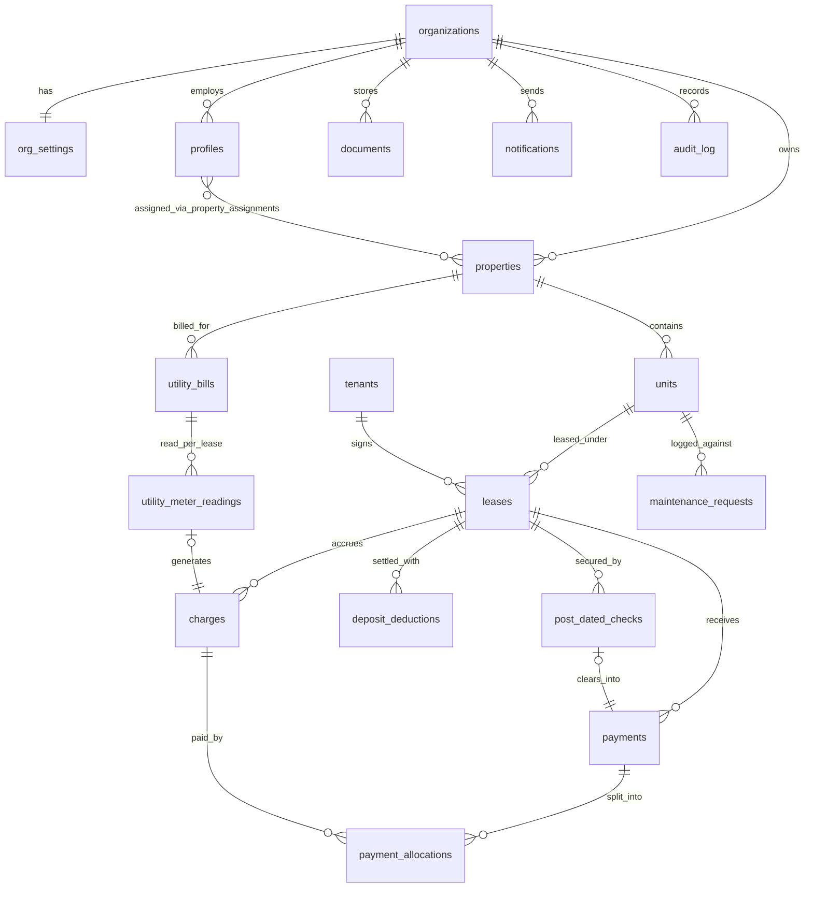

# StormlightPMS — Software Requirements Specification (SRS)

| Field | Value |
|-------|-------|
| Product | StormlightPMS — Stormlight Property Management System |
| Document | Software Requirements Specification |
| Version | **0.4** — v0.3 reconciled: **D6 (CWT / BIR Form 2307) deferred**, design tokens adopted, PRD authored as companion |
| Date | 2026-06-19 (v0.4); 2026-06-07 (v0.3); 2026-05-21 (v0.2) |
| Owner | GVL (Gerardo V. Laperal) |
| Operating entity | Stormlight Inc. — StormlightPMS is a **product line** of Stormlight Inc.; the superAdmin role is held by Stormlight Inc. as platform operator |
| Companion document | `StormlightPMS_PRD.md` (v0.4 — the product rationale; this SRS is the build contract) |
| Audience | Implementing developer(s) and Claude Code |
| Status | Revised — pending sign-off |

> **Version line note.** From v0.4 the PRD and SRS share one synchronized version number. The earlier Knack-era "v4.0 / v1.0" labels are abandoned. **v1.0 is reserved for the first production-deployed release.**

---

## 0. Changelog — v0.3 → v0.4

This revision reconciles the SRS to what is actually being built, authors a fresh companion PRD, and adopts the now-finalized design tokens. It is a build contract: every change below matches a decision GVL has frozen.

**Decisions frozen (v0.4)**

- **D6 REVERSED — BIR Form 2307 / 5% CWT withholding is DEFERRED, not in the MVP.** The entire CWT apparatus introduced in v0.3 is removed from the build contract and moved to the roadmap (§11.2, target v-next): the `form_2307_status` enum; the `pending_form_2307` value in `charge_status`; the `charges` columns `cwt_rate`, `cwt_amount`, `net_payable`, `form_2307_status`, `form_2307_url`, `form_2307_received_date`; the `leases` columns `is_cwt_applicable`, `withholding_tax_rate`; the CWT-derivation trigger; FR-CWT-1–5; FR-RPT-7; §6.15; and the CWT clauses in FR-DEP-1 and FR-LEASE-7. The allocation guard and charge-status trigger revert to v0.2 behavior (measured against the charge's gross `amount`). **Rationale:** the active build ships without CWT; a spec describing fields the code does not have is worse than useless. Re-adding D6 later is a clean, purely **additive** migration — exactly what D6 was.
- **D5, D7, D8 retained in full** — PDC Digital Vault (§4.22, §6.14, JOB-5), utility sub-metering (§4.23–4.24, §6.16, §9.5), and optional polymorphic unit `specs` (§4.6) remain in the MVP unchanged.
- **Design tokens adopted.** The StormlightPMS design system (navy / gold / teal / slate token scales, Spectral / Plus Jakarta Sans / JetBrains Mono) is finalized and embedded in §7.1 as the canonical UI source of truth. Open item **A5** (branding) is closed except for the logo asset, which remains pending.
- **Companion PRD authored.** `StormlightPMS_PRD.md` v0.4 is written fresh to match this contract; the stale Knack v4.0 PRD/SRS is retired.

**Improvements folded in (this is a Level-3 reconciliation: tighten + propose)**

- ER diagram added (§4.20).
- Generated, committed Supabase TypeScript types made an explicit build constraint (§2.4) and Definition-of-Done item (§10).
- The design-system retrofit is now a §7.1 requirement and a DoD item.
- Definition of Done (§10) rewritten to drop all CWT items and keep PDC + utility.
- **Open Recommendations appendix (§12)** added: latent defects and hardening gaps found in review, each flagged for GVL to **ACCEPT** or **REJECT**. None are silently baked into the spec body.

---

## 0a. Retained changelog — v0.2 → v0.3 (for provenance)

v0.3 reconciled an earlier combined "v1.0" PRD/SRS (conceptually older; the version numbers were inverted) against the v0.2 build contract. v0.2's architecture was retained in full; three Philippine-specific features were re-homed onto the normalized model:

- **D5** — **PDC (Post-Dated Check) Digital Vault — IN MVP.** Tracked in `post_dated_checks` (§4.22) with its own status lifecycle (§4.1 `pdc_status`); on clearing it materializes a `payments` row. Bulk status updates; stale-check sweep (§9 JOB-5). **(Retained in v0.4.)**
- **D6** — BIR Form 2307 / 5% CWT withholding. **REVERSED in v0.4 — see §0. Now roadmap (§11.2).**
- **D7** — **Utility sub-metering — IN MVP.** Master bill (`utility_bills`, §4.23) + per-unit readings (`utility_meter_readings`, §4.24) generate ordinary `charges` via an idempotent RPC, common-area variance surfaced. **(Retained in v0.4.)**
- **D8** — **Optional polymorphic unit `specs` — IN MVP.** `units.specs jsonb` (§4.6), Zod-driven dynamic field registry keyed on `property_type`. Automatic rent escalation stays out — `escalation_rate` / `escalation_frequency_months` remain reference-only (v2 roadmap). **(Retained in v0.4.)**

## 0b. Retained changelog — v0.1 → v0.2 (abridged, for provenance)

Frozen decisions: **D1** Vite + React SPA on Vercel (no Next.js/SSR — the app is entirely behind a login). **D2** authorization context (`org_id`, `role`) stamped into the JWT by a custom access-token hook; RLS reads `auth.jwt()`, never queries `profiles`. **D3** scoped CSV/seed import in MVP (§6.13). **D4** two-stage move-out: `deposit_refund = security_deposit_held − unpaid_utilities − damages`, floored at ₱0; advance rent never refunded (§6.8).

Key defect corrections carried forward: helper functions named `app_role()`/`app_org()`/`app_pm_property_ids()` (`current_role` is reserved); payment-allocation integrity enforced **only** by DB triggers with row locking; auth provisioning via invites carrying `org_id`+`role` in `user_metadata` and a `handle_new_user()` trigger; org-suspend/user-inactive via Auth ban + app-boot gate; mandatory `storage.objects` RLS; all date logic in `Asia/Manila`; deposits/advances are not charges; unallocated payment remainder surfaced as unapplied credit; charges not editable below allocated total (void-and-reissue); `audit_log` required and trigger-populated; reports are DB views/RPCs; idempotent notifications via dedupe key; `org_settings` for configurable windows; indexing + RLS-performance rules; `updated_at` trigger-maintained.

---

## 1. Introduction

### 1.1 Purpose
This document specifies the functional and non-functional requirements for the MVP of StormlightPMS in enough detail for a developer (or Claude Code) to implement it without further design decisions. It is the build contract; the PRD is the product rationale.

### 1.2 Scope
StormlightPMS MVP is a multi-tenant web application for Filipino landlords to manage properties, units, tenants, leases, charges, payments, deposits, post-dated checks, utility sub-metering, maintenance records, documents, notifications, and reports. Exclusions are listed in PRD §3.2 and §11.2 below.

### 1.3 Definitions and acronyms

| Term | Meaning |
|------|---------|
| Organization (org) | One landlord account; the SaaS tenant boundary. All operational data is org-scoped. |
| Property | A building or standalone real-estate asset belonging to an organization. |
| Unit | A rentable space within a property. A standalone house is a property with one unit. |
| Lease | A rental agreement linking one unit and one tenant for a term. |
| Charge | A billable line item against a lease (rent, utility, dues, penalty, move-out balance). |
| Payment | Money received against a lease, allocated to one or more charges. |
| Allocation | The applied amount linking a payment to a specific charge. |
| Unapplied credit | The portion of a payment not yet allocated to any charge. |
| Deposit / advance | Security deposit and advance rent held on a lease. **Not** charges; tracked on the lease record. |
| PDC | Post-Dated Check — a promise of future payment, tracked in the vault (§6.14). |
| RLS | Row Level Security — Postgres policy enforcement applied per row. |
| Access-token hook | A Supabase Auth hook that injects custom claims into the JWT at mint time. |
| superAdmin | Platform operator (Stormlight Inc.). Cross-organization access. |
| Admin | Landlord; owner of one organization. |
| Property_Manager (PM) | Staff scoped to specific assigned properties within one organization. |

### 1.4 References
`StormlightPMS_PRD.md` (v0.4); Supabase documentation (Auth, Custom Access Token Hook, RLS, Storage, Edge Functions, pg_cron, pg_net); the StormlightPMS design-token export (`StormlightPMS_Lessor_Dashboard.html`, §7.1).

---

## 2. Overall description

### 2.1 Product perspective
StormlightPMS is a new, self-contained system. It has no dependency on existing CCLDI or Gervel systems. It uses a single shared Supabase project; tenancy is logical, enforced by an `org_id` column and RLS on every operational table.

### 2.2 User classes
Three authenticated classes — superAdmin, Admin, Property_Manager (see PRD §4). Tenants are data records with no login in the MVP.

### 2.3 Operating environment
Modern desktop and mobile browsers (latest two versions of Chrome, Edge, Safari, Firefox). Frontend is a static Vite build served from Vercel; backend on Supabase cloud.

### 2.4 Design and implementation constraints
- **Backend:** Supabase only — Postgres, Auth, Storage, Edge Functions (Deno), pg_cron, pg_net. No VPS, no self-hosted services.
- **Frontend (D1):** Vite + React + TypeScript, single-page app. Routing via React Router. Server state via TanStack Query over the typed `@supabase/supabase-js` client. Styling via Tailwind CSS wired to the §7.1 design tokens. Forms via React Hook Form + Zod. No Next.js, no server-side rendering.
- **Database changes:** version-controlled SQL migrations only, applied via the Supabase CLI; append-only numbered files (never edit a shipped migration). Lowercase SQL. Money columns are `numeric(14,2)`.
- **Generated types (build constraint):** `src/lib/database.types.ts` is generated from the live schema (`npm run gen:types`) and **committed**; `src/lib/supabase.ts` uses `createClient<Database>(...)`. No `any`. Types are regenerated and committed whenever the schema changes; a stale or placeholder types file is a DoD failure.
- **Currency:** PHP only. **Timezone:** Asia/Manila. **UI language:** English.

### 2.5 Assumptions and dependencies
See PRD §12. A transactional email provider (Resend recommended) is required for the §9 jobs. The provider API key and the Supabase service-role key are stored in **Supabase Vault**, never in the client bundle.

### 2.6 Timezone rule (global)
Every "today", "overdue", "due soon", and date-stamping computation uses Manila local time:
```sql
(now() at time zone 'Asia/Manila')::date
```
`due_date`, `billing_period`, `payment_date`, `start_date`, `end_date` and all other `date` columns are interpreted as Manila calendar dates. pg_cron schedules are written in UTC but chosen to fire at the intended Manila wall-clock time (Manila is UTC+8, no DST).

---

## 3. System architecture

```
        Browser (responsive SPA)
                 |
                 v
   Vite + React app  ──static build──>  Vercel
                 |
        Supabase JS client (RLS-enforced)
                 |
   ┌─────────────┴───────────────────────────────┐
   |                 Supabase                     |
   |  Postgres (RLS)   Auth + access-token hook   |
   |  Storage          Edge Functions             |
   |  pg_cron + pg_net (scheduled jobs)           |
   |  Vault (secrets)                             |
   └──────────────────────────────────────────────┘
                 |
        Transactional email provider (Resend)
```

| Component | Responsibility |
|-----------|----------------|
| Vite/React SPA | UI, routing, forms, role-aware navigation; all data access through the Supabase client |
| Postgres + RLS | System of record; access control enforced at the row level |
| Supabase Auth | Identity, sessions, email invites, password reset |
| Access-token hook | Injects `org_id`, `role`, and `profile_status` into the JWT `app_metadata` at token mint |
| Supabase Storage | Private buckets for documents and proof-of-payment files; object-level RLS + signed URLs |
| Edge Functions | Invite issuance, org-suspend ban toggling, scheduled notification fan-out, outbound email |
| pg_cron + pg_net | Trigger the daily notification and lease-transition jobs (§9) |
| Vault | Holds the service-role key and email-provider API key |

Storage buckets (all private): `documents`, `payment-proofs`, `property-photos`.

---

## 4. Data model

All tables use `uuid` primary keys (`gen_random_uuid()`), `created_at timestamptz default now()`, and `created_by uuid` referencing `profiles(id)` unless noted. Every operational table carries `org_id` for tenancy isolation. Monetary columns are `numeric(14,2)`. `updated_at timestamptz` is present on every table marked "standard" and is maintained by a trigger (§9.4) — never set by the client.

### 4.1 Enumerations

| Enum | Values |
|------|--------|
| `user_role` | `superadmin`, `admin`, `property_manager` |
| `org_status` | `active`, `suspended` |
| `profile_status` | `active`, `inactive` |
| `property_type` | `residential`, `commercial`, `mixed` |
| `property_status` | `active`, `archived` |
| `unit_status` | `vacant`, `occupied`, `under_maintenance`, `unavailable` |
| `lease_status` | `draft`, `active`, `expired`, `terminated`, `renewed` |
| `charge_type` | `rent`, `utility_electricity`, `utility_water`, `association_dues`, `parking`, `penalty`, `move_out_balance`, `other` |
| `charge_status` | `unpaid`, `partially_paid`, `paid`, `void` |
| `payment_method` | `cash`, `bank_transfer`, `gcash`, `maya`, `check`, `other` |
| `payment_status` | `active`, `void` |
| `deduction_category` | `unpaid_utility`, `damage` |
| `maintenance_status` | `open`, `in_progress`, `completed`, `cancelled` |
| `maintenance_priority` | `low`, `medium`, `high`, `urgent` |
| `doc_type` | `lease_contract`, `tenant_id`, `payment_proof`, `property_photo`, `settlement`, `other` |
| `notification_type` | `rent_due`, `rent_overdue`, `lease_expiring`, `maintenance_update`, `pdc_stale`, `system` |
| `pdc_status` | `vaulted`, `deposited`, `cleared`, `bounced`, `stale` |
| `utility_type` | `electricity`, `water` |
| `utility_allocation_method` | `by_submeter`, `equal_split`, `by_floor_area` |

> **Removed in v0.4 (D6 deferral):** the `form_2307_status` enum, and the `pending_form_2307` value from `charge_status`.

### 4.2 Table: organizations

| Column | Type | Constraints |
|--------|------|-------------|
| id | uuid | PK |
| name | text | not null |
| owner_profile_id | uuid | FK → profiles(id), nullable until first Admin provisioned |
| contact_email | text | nullable |
| contact_phone | text | nullable |
| status | org_status | not null, default `active` |
| created_at | timestamptz | default now() |
| created_by | uuid | FK → profiles(id) — a superAdmin |
| updated_at | timestamptz | standard |

### 4.3 Table: profiles
One row per authenticated user; `id` equals the Supabase `auth.users` id.

| Column | Type | Constraints |
|--------|------|-------------|
| id | uuid | PK, FK → auth.users(id) on delete cascade |
| org_id | uuid | FK → organizations(id); **null only for superadmin** |
| role | user_role | not null |
| full_name | text | not null |
| email | text | not null — denormalized copy of auth.users.email; see note |
| phone | text | nullable |
| status | profile_status | not null, default `active` |
| created_at | timestamptz | default now() |
| created_by | uuid | nullable (first superAdmin is seeded) |
| updated_at | timestamptz | standard |

Note: `profiles.email` is a convenience copy of `auth.users.email`. It is set by `handle_new_user()` and is not the authentication identity. For the MVP, email is immutable post-invite.

### 4.4 Table: property_assignments
Scopes a Property_Manager to specific properties.

| Column | Type | Constraints |
|--------|------|-------------|
| id | uuid | PK |
| org_id | uuid | not null, FK → organizations(id) |
| profile_id | uuid | not null, FK → profiles(id); profile.role must be `property_manager` |
| property_id | uuid | not null, FK → properties(id) |
| created_at | timestamptz | default now() |
| created_by | uuid | FK → profiles(id) |
| | | UNIQUE (profile_id, property_id) |

### 4.5 Table: properties

| Column | Type | Constraints |
|--------|------|-------------|
| id | uuid | PK |
| org_id | uuid | not null, FK → organizations(id) |
| name | text | not null |
| property_type | property_type | not null |
| region | text | nullable |
| province | text | nullable |
| city_municipality | text | nullable |
| barangay | text | nullable |
| street_address | text | nullable |
| postal_code | text | nullable |
| description | text | nullable |
| status | property_status | not null, default `active` |
| created_at / created_by / updated_at | — | standard |

### 4.6 Table: units

| Column | Type | Constraints |
|--------|------|-------------|
| id | uuid | PK |
| org_id | uuid | not null, FK → organizations(id) |
| property_id | uuid | not null, FK → properties(id) |
| unit_label | text | not null |
| floor | text | nullable |
| bedrooms | integer | nullable |
| floor_area_sqm | numeric(10,2) | nullable |
| base_monthly_rent | numeric(14,2) | not null, ≥ 0 |
| unit_status | unit_status | not null, default `vacant` |
| specs | jsonb | not null, default `'{}'::jsonb` — **optional** asset-class-specific fields (D8); see note |
| notes | text | nullable |
| created_at / created_by / updated_at | — | standard |
| | | UNIQUE (property_id, unit_label) |

**`units.specs` (D8):** an additive, optional bag of asset-class-specific attributes (e.g. warehouse `apex_height_m`, `loading_docks`; condo `balcony_sqm`). The fixed columns above are unchanged and remain the canonical inventory fields. The set of `specs` keys offered for a unit is driven by an **app-side field registry keyed on the parent property's `property_type`** (a TypeScript + Zod schema map, not `react-jsonschema-form`); the database stores the resulting JSON without per-key constraints. No reporting or RLS logic depends on `specs` in the MVP.

### 4.7 Table: tenants

| Column | Type | Constraints |
|--------|------|-------------|
| id | uuid | PK |
| org_id | uuid | not null, FK → organizations(id) |
| full_name | text | not null |
| email | text | nullable |
| phone | text | nullable |
| gov_id_type | text | nullable |
| gov_id_number | text | nullable |
| emergency_contact_name | text | nullable |
| emergency_contact_phone | text | nullable |
| notes | text | nullable |
| status | text | not null, default `active` (`active` / `archived`) |
| created_at / created_by / updated_at | — | standard |

### 4.8 Table: leases

| Column | Type | Constraints |
|--------|------|-------------|
| id | uuid | PK |
| org_id | uuid | not null, FK → organizations(id) |
| unit_id | uuid | not null, FK → units(id) |
| tenant_id | uuid | not null, FK → tenants(id) |
| lease_status | lease_status | not null, default `draft` |
| start_date | date | not null |
| end_date | date | not null; CHECK end_date ≥ start_date |
| monthly_rent | numeric(14,2) | not null, > 0 |
| payment_due_day | integer | not null, default 5; CHECK 1–28 |
| advance_months | numeric(4,2) | default 1, ≥ 0 |
| advance_amount | numeric(14,2) | default 0, ≥ 0 — prepaid rent; reference only, never refunded |
| security_deposit_months | numeric(4,2) | default 2, ≥ 0 |
| security_deposit_amount | numeric(14,2) | default 0, ≥ 0 — the refundable deposit held |
| escalation_rate | numeric(5,2) | default 0 — percent, reference only |
| escalation_frequency_months | integer | default 12 — reference only |
| renewed_from_lease_id | uuid | FK → leases(id), nullable |
| termination_date | date | nullable — stage-1 vacate date |
| termination_reason | text | nullable |
| deposit_settled_date | date | nullable — stage-2 final settlement date |
| deposit_refund_amount | numeric(14,2) | nullable — computed at settlement (§6.8) |
| created_at / created_by / updated_at | — | standard |

> **Removed in v0.4 (D6 deferral):** `is_cwt_applicable`, `withholding_tax_rate`.

Rule: at most one lease per unit may be in `active` status at any time — enforced by a partial unique index `UNIQUE (unit_id) WHERE lease_status = 'active'`.

### 4.9 Table: charges

| Column | Type | Constraints |
|--------|------|-------------|
| id | uuid | PK |
| org_id | uuid | not null, FK → organizations(id) |
| lease_id | uuid | not null, FK → leases(id) |
| charge_type | charge_type | not null |
| description | text | nullable |
| billing_period | date | nullable — first day of the month covered |
| amount | numeric(14,2) | not null, CHECK > 0 |
| due_date | date | not null |
| charge_status | charge_status | not null, default `unpaid` — maintained by trigger (§9.4); never set by the client |
| voided_at | timestamptz | nullable |
| voided_by | uuid | nullable, FK → profiles(id) |
| created_at / created_by / updated_at | — | standard |

> **Removed in v0.4 (D6 deferral):** `cwt_rate`, `cwt_amount`, `net_payable`, `form_2307_status`, `form_2307_url`, `form_2307_received_date`. A charge's full `amount` is the tenant's obligation; allocations are capped at `amount` (§4.11).

### 4.10 Table: payments

| Column | Type | Constraints |
|--------|------|-------------|
| id | uuid | PK |
| org_id | uuid | not null, FK → organizations(id) |
| lease_id | uuid | not null, FK → leases(id) |
| amount | numeric(14,2) | not null, CHECK > 0 |
| payment_date | date | not null |
| payment_method | payment_method | not null |
| reference_no | text | nullable |
| proof_url | text | nullable — Storage path in `payment-proofs` |
| notes | text | nullable |
| payment_status | payment_status | not null, default `active` |
| voided_at | timestamptz | nullable |
| voided_by | uuid | nullable, FK → profiles(id) |
| recorded_by | uuid | not null, FK → profiles(id) |
| created_at | timestamptz | default now() |
| updated_at | timestamptz | standard |

### 4.11 Table: payment_allocations
Links a payment to the charge(s) it pays; supports split and partial payments.

| Column | Type | Constraints |
|--------|------|-------------|
| id | uuid | PK |
| org_id | uuid | not null, FK → organizations(id) |
| payment_id | uuid | not null, FK → payments(id) |
| charge_id | uuid | not null, FK → charges(id) |
| amount_applied | numeric(14,2) | not null, CHECK > 0 |
| created_at | timestamptz | default now() |
| | | UNIQUE (payment_id, charge_id) — one allocation row per payment/charge pair; adjust the amount, do not add a second row |

**Integrity rules — enforced by database trigger only (§9.4), with row locking:**
- SUM(`amount_applied`) for a payment ≤ that payment's `amount`.
- SUM(`amount_applied`) for a charge ≤ that charge's **`amount`**.
- A payment and the charges it is allocated to must share the same `lease_id`.
- Allocations may not target a `void` charge or belong to a `void` payment.

These rules are **not** enforced in the application layer. The application may pre-validate for UX, but the trigger is the authority.

### 4.12 Table: deposit_deductions
Itemized deductions applied against a lease's security deposit at move-out (§6.8).

| Column | Type | Constraints |
|--------|------|-------------|
| id | uuid | PK |
| org_id | uuid | not null, FK → organizations(id) |
| lease_id | uuid | not null, FK → leases(id) |
| deduction_category | deduction_category | not null — `unpaid_utility` or `damage` |
| description | text | not null |
| amount | numeric(14,2) | not null, CHECK > 0 |
| created_at / created_by | — | standard |

### 4.13 Table: maintenance_requests

| Column | Type | Constraints |
|--------|------|-------------|
| id | uuid | PK |
| org_id | uuid | not null, FK → organizations(id) |
| unit_id | uuid | not null, FK → units(id) |
| lease_id | uuid | FK → leases(id), nullable |
| title | text | not null |
| description | text | nullable |
| priority | maintenance_priority | not null, default `medium` |
| status | maintenance_status | not null, default `open` |
| reported_date | date | not null, default Manila today |
| resolved_date | date | nullable; CHECK required when status = `completed` |
| cost | numeric(14,2) | nullable, ≥ 0 |
| assigned_to | text | nullable — free-text vendor/person in MVP |
| created_at / created_by / updated_at | — | standard |

### 4.14 Table: documents

| Column | Type | Constraints |
|--------|------|-------------|
| id | uuid | PK |
| org_id | uuid | not null, FK → organizations(id) |
| doc_type | doc_type | not null |
| entity_type | text | not null — `lease` / `tenant` / `property` / `unit` / `payment` |
| entity_id | uuid | not null |
| bucket | text | not null — `documents` / `payment-proofs` / `property-photos` |
| file_path | text | not null — full Storage object path, org-prefixed |
| file_name | text | nullable |
| uploaded_by | uuid | not null, FK → profiles(id) |
| created_at | timestamptz | default now() |

### 4.15 Table: notifications

| Column | Type | Constraints |
|--------|------|-------------|
| id | uuid | PK |
| org_id | uuid | not null, FK → organizations(id) |
| profile_id | uuid | not null, FK → profiles(id) — recipient |
| notification_type | notification_type | not null |
| title | text | not null |
| body | text | nullable |
| entity_type | text | nullable |
| entity_id | uuid | nullable |
| dedupe_key | text | not null — see §4.16 |
| is_read | boolean | not null, default false |
| email_sent_at | timestamptz | nullable |
| created_at | timestamptz | default now() |

### 4.16 Notification idempotency
`notifications` carries `UNIQUE (dedupe_key)`. Scheduled jobs (§9) construct `dedupe_key` deterministically so a re-run cannot create duplicates, e.g.:
- rent-due: `rent_due:{charge_id}:{manila_date}`
- overdue: `rent_overdue:{charge_id}:{manila_date}`
- lease-expiring: `lease_expiring:{lease_id}:{threshold}` where threshold ∈ {60, 30}
- stale PDC: `pdc_stale:{pdc_id}`

Jobs insert with `ON CONFLICT (dedupe_key) DO NOTHING`.

### 4.17 Table: audit_log — REQUIRED
Populated exclusively by `SECURITY DEFINER` triggers (§9.4), not by client code. Covers create/update/delete/void on `leases`, `charges`, `payments`, `payment_allocations`, `deposit_deductions`, and `post_dated_checks` (NFR-11).

| Column | Type | Constraints |
|--------|------|-------------|
| id | uuid | PK |
| org_id | uuid | nullable |
| profile_id | uuid | FK → profiles(id) — resolved from `auth.uid()` |
| action | text | not null — `create`, `update`, `delete`, `void` |
| entity_type | text | not null |
| entity_id | uuid | nullable |
| detail | jsonb | nullable — before/after snapshot |
| created_at | timestamptz | default now() |

`audit_log` is append-only: no `UPDATE` or `DELETE` policy is granted to any role.

### 4.18 Table: org_settings
One row per organization; holds configurable job parameters (FR-NOTIF-1).

| Column | Type | Constraints |
|--------|------|-------------|
| org_id | uuid | PK, FK → organizations(id) |
| rent_due_window_days | integer | not null, default 3 |
| lease_expiry_thresholds | integer[] | not null, default `{60,30}` |
| reminder_email_enabled | boolean | not null, default true |
| updated_at | timestamptz | standard |

A row is created automatically when an organization is created.

### 4.19 Indexing and RLS performance
- Index every `org_id` column and every foreign-key column.
- Composite indexes where jobs/reports filter: `charges (org_id, charge_status, due_date)`, `leases (org_id, lease_status, end_date)`, `payment_allocations (charge_id)`, `payment_allocations (payment_id)`, `post_dated_checks (org_id, status, check_date)`, `utility_meter_readings (utility_bill_id)`.
- Partial unique index on `leases (unit_id) WHERE lease_status = 'active'`.
- RLS policies must wrap helper calls as scalar sub-selects — `(SELECT app_org())` — so Postgres evaluates them once per query rather than once per row.

> **Removed in v0.4 (D6 deferral):** the partial index `charges (org_id, due_date) WHERE charge_status = 'pending_form_2307'`.

### 4.20 Relationships

```
organizations 1──1 org_settings
organizations 1──* profiles
organizations 1──* properties 1──* units
units 1──* leases *──1 tenants
leases 1──* charges
leases 1──* payments 1──* payment_allocations *──1 charges
leases 1──* deposit_deductions
leases 1──* post_dated_checks  (cleared check 1──1 payments)
properties 1──* utility_bills 1──* utility_meter_readings *──1 leases
utility_meter_readings 0..1──1 charges  (generated_charge_id)
units 1──* maintenance_requests
profiles *──* properties   (via property_assignments)
organizations 1──* documents / notifications / audit_log
```

**ER diagram (entity relationships, MVP):**



### 4.21 Deletion policy
Financial and lease records are **never hard-deleted**: `leases`, `charges`, `payments`, `payment_allocations`, `deposit_deductions`, `post_dated_checks`, `audit_log`. Charges and payments are retired via `void`; leases via `terminated`/`expired`; PDCs via their status lifecycle (`bounced`/`stale`). `properties` and `tenants` are archived via their `status` column. Only `documents` (FR-DOC-3), draft leases with no children, unassigned `property_assignments`, and a `utility_bills` row with no generated charges may be hard-deleted.

### 4.22 Table: post_dated_checks (D5)
A post-dated check is a **promise of future payment**, not received money; it does not affect the lease ledger until it clears (§6.14).

| Column | Type | Constraints |
|--------|------|-------------|
| id | uuid | PK |
| org_id | uuid | not null, FK → organizations(id) |
| lease_id | uuid | not null, FK → leases(id) |
| check_number | text | not null |
| issuing_bank | text | not null |
| check_date | date | not null — maturity date printed on the check |
| amount | numeric(14,2) | not null, CHECK > 0 |
| status | pdc_status | not null, default `vaulted` |
| deposited_date | date | nullable |
| cleared_date | date | nullable |
| bounced_reason | text | nullable |
| linked_payment_id | uuid | nullable, FK → payments(id) — set when the check clears |
| notes | text | nullable |
| created_at / created_by / updated_at | — | standard |
| | | UNIQUE (org_id, issuing_bank, check_number) |

On transition to `cleared`, the system creates a `payments` row (`payment_method = check`, `payment_date = cleared_date`, `amount`) and stores its id in `linked_payment_id`; allocation to charges then follows the normal payment path (§6.7). A `bounced` check has no active payment (any linked payment is voided); a penalty charge may be raised manually.

### 4.23 Table: utility_bills (D7)
A master utility bill for a property and billing period, to be apportioned across active leases.

| Column | Type | Constraints |
|--------|------|-------------|
| id | uuid | PK |
| org_id | uuid | not null, FK → organizations(id) |
| property_id | uuid | not null, FK → properties(id) |
| utility_type | utility_type | not null |
| billing_period | date | not null — first day of the month covered |
| provider | text | nullable — e.g. Meralco, Maynilad |
| total_amount | numeric(14,2) | not null, CHECK > 0 |
| total_consumption | numeric(14,2) | nullable — kWh / cu.m, for variance reporting |
| bill_date | date | nullable |
| due_date | date | not null — propagated to generated charges |
| allocation_method | utility_allocation_method | not null, default `by_submeter` |
| charges_generated_at | timestamptz | nullable — set when generation runs; the idempotency gate |
| created_at / created_by / updated_at | — | standard |
| | | UNIQUE (property_id, utility_type, billing_period) |

### 4.24 Table: utility_meter_readings (D7)
Per-lease sub-meter readings for one `utility_bills` row.

| Column | Type | Constraints |
|--------|------|-------------|
| id | uuid | PK |
| org_id | uuid | not null, FK → organizations(id) |
| utility_bill_id | uuid | not null, FK → utility_bills(id) |
| lease_id | uuid | not null, FK → leases(id) |
| previous_reading | numeric(14,2) | not null, ≥ 0 |
| current_reading | numeric(14,2) | not null, ≥ 0, CHECK ≥ previous_reading |
| consumption | numeric(14,2) | not null — `current_reading − previous_reading` |
| computed_share | numeric(14,2) | nullable — the peso amount apportioned to this lease at generation |
| generated_charge_id | uuid | nullable, FK → charges(id) — set when the utility charge is created |
| created_at / created_by / updated_at | — | standard |
| | | UNIQUE (utility_bill_id, lease_id) |

---

## 5. Security and access control

### 5.1 Authentication and provisioning
Supabase Auth with email/password. There is no public sign-up.

**Provisioning a new organization and its first Admin (FR-ORG-1, FR-AUTH-2):**
1. A superAdmin calls the `invite-user` Edge Function with `{ email, full_name, role: 'admin', org_id }`.
2. The function uses the service-role key to call `auth.admin.inviteUserByEmail`, passing `org_id`, `role`, and `full_name` in `user_metadata`.
3. The invitee receives an email, follows the link, and sets a password.
4. On the `auth.users` insert, the `handle_new_user()` trigger reads `user_metadata` and inserts the matching `profiles` row with the correct `org_id` and `role`.
5. For the first Admin of an org, the function also sets `organizations.owner_profile_id`.

**Provisioning a Property_Manager (FR-AUTH-3):** identical flow, initiated by an Admin, with `role: 'property_manager'` and the Admin's own `org_id` (the function rejects any other `org_id`).

**First superAdmin** is seeded directly via migration/seed script — there is no inviter for the first account.

Password reset uses Supabase's standard email flow. Minimum password length 8 with complexity enforced in Auth settings.

### 5.2 Authorization context — the access-token hook (D2)
A **custom access-token hook** runs at JWT mint. It looks up the user's `profiles` row and writes `org_id`, `role`, and `profile_status` into the token's `app_metadata`. RLS then resolves the caller's context from the JWT — never by querying `profiles` inside a policy. This is what removes the recursion hazard.

Three helper functions, all `STABLE` and reading only the JWT:
```sql
create or replace function app_role() returns text
  language sql stable as
$$ select coalesce(auth.jwt() -> 'app_metadata' ->> 'role', '') $$;

create or replace function app_org() returns uuid
  language sql stable as
$$ select nullif(auth.jwt() -> 'app_metadata' ->> 'org_id', '')::uuid $$;
```
`app_pm_property_ids()` returns the set of `property_id` values assigned to the caller. It reads `property_assignments` and is therefore `SECURITY DEFINER` (so it bypasses RLS and cannot recurse):
```sql
create or replace function app_pm_property_ids() returns setof uuid
  language sql stable security definer set search_path = public as
$$ select property_id from property_assignments where profile_id = auth.uid() $$;
```
Staleness note: role/org changes take effect on the user's next token refresh. For the MVP this is acceptable; a forced re-login on role change is a v2 refinement.

### 5.3 RLS policy matrix
RLS is enabled **and forced** (`FORCE ROW LEVEL SECURITY`) on every operational table. No policy grants any access to the `anon` role. `profiles` policies reference `auth.uid()` directly and must not call `app_role()`/`app_org()`.

| Table | superAdmin | Admin | Property_Manager |
|-------|-----------|-------|------------------|
| organizations | all | own org row (read; update contact only) | own org row, read-only |
| org_settings | all | own org row (read/update) | own org row, read-only |
| profiles | all | rows where `org_id = app_org()` | own row + others in org, read-only |
| property_assignments | all | rows in own org (full) | own assignment rows, read-only |
| properties | all | `org_id = app_org()` | `id IN app_pm_property_ids()` |
| units | all | `org_id = app_org()` | `property_id IN app_pm_property_ids()` |
| tenants | all | `org_id = app_org()` | `org_id = app_org()` *(see §5.4)* |
| leases | all | `org_id = app_org()` | `unit_id` belongs to a property in `app_pm_property_ids()` |
| charges | all | `org_id = app_org()` | `lease_id` reachable via an assigned property |
| payments / payment_allocations | all | `org_id = app_org()` | `lease_id` reachable via an assigned property |
| deposit_deductions | all | `org_id = app_org()` | `lease_id` reachable via an assigned property |
| post_dated_checks | all | `org_id = app_org()` | `lease_id` reachable via an assigned property |
| utility_bills | all | `org_id = app_org()` | `property_id IN app_pm_property_ids()` |
| utility_meter_readings | all | `org_id = app_org()` | `lease_id` reachable via an assigned property |
| maintenance_requests | all | `org_id = app_org()` | `unit_id` reachable via an assigned property |
| documents | all | `org_id = app_org()` | assigned-property scope *(OR-5 ACCEPTED — tightened from the MVP org-wide simplification)* |
| notifications | all | own org rows | rows where `profile_id = auth.uid()` |
| audit_log | all (read) | own org rows, read-only | none |

`charge_status`, `payment_status`, `unit_status`, and `lease`-derived deposit fields are maintained by triggers; client `UPDATE` of these columns is rejected by a column-level guard trigger.

### 5.4 Deliberate decision — tenant visibility for Property_Managers
Tenant records are not property-bound, so in the MVP a Property_Manager can read and create tenant records org-wide. Property-scoped data (units, leases, charges, payments, maintenance) remains restricted by assignment. Tradeoff: a PM can see tenant contact details for properties they do not manage. Accepted for MVP simplicity; tightening is a v2 candidate. *(Note: `documents` is tightened to assigned-property scope per OR-5; tenants remain org-wide.)*

### 5.5 Sample RLS policy (units)
```sql
alter table units enable row level security;
alter table units force row level security;

create policy units_superadmin on units
  for all to authenticated
  using (app_role() = 'superadmin')
  with check (app_role() = 'superadmin');

create policy units_admin on units
  for all to authenticated
  using (app_role() = 'admin' and org_id = (select app_org()))
  with check (app_role() = 'admin' and org_id = (select app_org()));

create policy units_pm on units
  for all to authenticated
  using (
    app_role() = 'property_manager'
    and property_id in (select app_pm_property_ids())
  )
  with check (
    app_role() = 'property_manager'
    and property_id in (select app_pm_property_ids())
  );
```
Every policy specifies both `using` and `with check` so reads and writes are constrained identically.

### 5.6 Storage security
All three buckets are private. Object paths are org-prefixed: `{bucket}/{org_id}/{entity_id}/{filename}`.
`storage.objects` carries its own RLS policies — signed URLs are a delivery mechanism, not access control. Example for `payment-proofs`:
```sql
create policy payment_proofs_org on storage.objects
  for all to authenticated
  using (
    bucket_id = 'payment-proofs'
    and (
      app_role() = 'superadmin'
      or (storage.foldername(name))[1] = (select app_org())::text
    )
  )
  with check (
    bucket_id = 'payment-proofs'
    and (storage.foldername(name))[1] = (select app_org())::text
  );
```
Downloads use short-lived signed URLs (default TTL 60 s) issued only after the parent record passes an RLS-permitted read.

### 5.7 Other security requirements
HTTPS only. No payment-card data is ever stored (record-only model). Service-role and email-provider keys live in Supabase Vault and are used only inside Edge Functions; they never reach the browser. The browser holds only the anon/publishable key.

### 5.8 Org suspension and user deactivation — enforcement
RLS cannot prevent a login; the JWT is issued by Auth before any policy runs. Enforcement is therefore two-layered:
1. **Auth ban (authoritative).** Suspending an organization (FR-ORG-2) or deactivating a profile (FR-AUTH-6) invokes an Edge Function that sets `banned_until` far in the future on the affected `auth.users` rows via the admin API. Reactivation clears it. A banned user cannot obtain a session.
2. **App-boot gate (defense in depth).** Immediately after session load, the SPA reads the caller's `profile_status` and `organizations.status`. If either is not `active`, the app signs the user out and shows a "contact the administrator" screen. This also covers any token minted before a ban propagated.

The access-token hook additionally refuses to mint app claims for an `inactive` profile.

---

## 6. Functional requirements
Each requirement has an ID, a statement, and acceptance criteria (AC). "User" means any authenticated user permitted by §5.

### 6.1 AUTH — Authentication & users
| ID | Requirement | AC |
|----|-------------|----|
| FR-AUTH-1 | Users log in with email and password via Supabase Auth | Valid credentials grant a session; invalid credentials show an error and grant none |
| FR-AUTH-2 | A superAdmin can invite a user as the first Admin of an organization (§5.1) | Invitee receives an email, sets a password, and lands with `admin` role and the correct `org_id`; the org's `owner_profile_id` is set |
| FR-AUTH-3 | An Admin can invite a user as a Property_Manager within the Admin's organization | Invitee is created with `property_manager` role and the Admin's `org_id`; any other `org_id` is rejected by the Edge Function |
| FR-AUTH-4 | Any user can reset a forgotten password via email | A reset email is sent; following it lets the user set a new password |
| FR-AUTH-5 | Navigation and actions are filtered by role | A PM never sees superAdmin or Admin-only screens; the UI matches §5 permissions |
| FR-AUTH-6 | An Admin can set a Property_Manager's status to `inactive` | Per §5.8 the user is banned in Auth and cannot log in; data they created is retained; reactivation restores access |

### 6.2 ORG — Organization management
| ID | Requirement | AC |
|----|-------------|----|
| FR-ORG-1 | A superAdmin can create an organization (name, contact details) | The org appears with `status = active`; an `org_settings` row is auto-created |
| FR-ORG-2 | A superAdmin can suspend or reactivate an organization | Suspending bans all users in the org per §5.8; reactivating restores them |
| FR-ORG-3 | A superAdmin can view all organizations with property/unit/user counts | Counts are accurate and update as data changes |

### 6.3 PROP — Property & unit management
| ID | Requirement | AC |
|----|-------------|----|
| FR-PROP-1 | A user can create a property (name, type, Philippine address) | The property is created under the user's `org_id` |
| FR-PROP-2 | A user can add one or more units to a property (label, base rent, status, and optional asset-class `specs`) | A standalone property is supported as a property with a single unit; the unit form offers asset-class-specific `specs` fields driven by the parent `property_type` registry (D8), all optional |
| FR-PROP-3 | A user can edit a property or unit | Changes persist; `updated_at` advances via trigger |
| FR-PROP-4 | A user can archive a property | Archived properties are hidden from default lists but retained |
| FR-PROP-5 | Unit status reflects lease state automatically per §6.5 transition table | The unit-status trigger applies every transition; client cannot set `unit_status` directly |
| FR-PROP-6 | An Admin can assign a Property_Manager to one or more properties | The PM thereafter sees only assigned properties (§5) |

### 6.4 TEN — Tenant management
| ID | Requirement | AC |
|----|-------------|----|
| FR-TEN-1 | A user can create a tenant record (name, contacts, government ID, emergency contact) | Tenant is created under the user's `org_id` |
| FR-TEN-2 | A user can edit a tenant record | Changes persist |
| FR-TEN-3 | A user can view a tenant's lease history | All leases linking that tenant are listed with status |
| FR-TEN-4 | A tenant with an active lease cannot be deleted | Deletion is blocked with a clear message; archiving is allowed (enforcement: OR-1 ACCEPTED — BEFORE DELETE trigger) |

### 6.5 LEASE — Lease management
| ID | Requirement | AC |
|----|-------------|----|
| FR-LEASE-1 | A user can create a lease linking one vacant unit and one tenant, with term, monthly rent, due day, advance and deposit fields | Lease is created in `draft`; only a unit with `unit_status = vacant` may be selected |
| FR-LEASE-2 | A user can activate a draft lease | Status → `active`; unit → `occupied`; a second active lease on the same unit is rejected by the partial unique index |
| FR-LEASE-3 | The system stores escalation rate and frequency for reference | Values are displayed on the lease; no automatic rent change occurs |
| FR-LEASE-4 | A user can renew a lease, creating a new lease linked via `renewed_from_lease_id` | Old lease → `renewed`; new lease starts in `draft` with pre-filled terms; the unit stays `occupied` throughout |
| FR-LEASE-5 | A user can terminate an active lease with a date and reason (stage-1 vacate) | Status → `terminated`; `termination_date` set; unit → `vacant`; the deposit-settlement flow (§6.8) becomes available |
| FR-LEASE-6 | A lease whose `end_date` has passed is treated as expired | The §9 job sets it `expired` and the unit `vacant`; expired leases are excluded from active rent rolls |
| FR-LEASE-7 | A lease detail view shows the tenant ledger | The ledger shows all charges, all payments and their allocations, the **outstanding balance**, any **unapplied credit**, and the deposit/advance held — see formula below |

**Lease ledger figures (FR-LEASE-7):**
- Outstanding balance = SUM(`amount` of non-void charges) − SUM(`amount_applied` of allocations to non-void charges from non-void payments).
- Unapplied credit = SUM(non-void payment `amount`) − SUM(all `amount_applied` from non-void payments). Shown as available to allocate.
- Deposit held and advance held are shown from the lease record; they are **not** part of the outstanding balance.

> **Removed in v0.4 (D6 deferral):** the per-charge gross/CWT-withheld/net-payable/Form-2307 ledger lines.

**`lease_status` → `unit_status` transition table (FR-PROP-5):**

| Lease event | New lease_status | Resulting unit_status |
|-------------|------------------|------------------------|
| Lease created | `draft` | unchanged (unit stays `vacant`) |
| Draft activated | `active` | `occupied` |
| Active terminated | `terminated` | `vacant` |
| Active passes end_date (§9 JOB-4) | `expired` | `vacant` |
| Lease renewed | `renewed` (old) + `draft` (new) | unchanged — unit stays `occupied`; the new lease's activation is a no-op on an already-occupied unit |
| Draft deleted/discarded | — | unchanged |

The unit-status trigger never moves a unit out of `under_maintenance` or `unavailable`; those are set manually and a lease cannot be activated against a unit in either state.

### 6.6 CHG — Charges
| ID | Requirement | AC |
|----|-------------|----|
| FR-CHG-1 | A user can create a charge on a lease (type, description, amount, billing period, due date) | Charge is created with `charge_status = unpaid` |
| FR-CHG-2 | Supported charge types are rent, electricity, water, association/CUSA dues, parking, penalty, move-out balance, other | All enum values are selectable; `move_out_balance` is normally system-created (§6.8) but may be entered manually |
| FR-CHG-3 | A user can edit an unpaid charge, or void a charge | A charge with any allocation cannot have its `amount` reduced below the allocated total; voiding requires the charge to be fully unallocated; voiding sets `charge_status = void`, `voided_at`, `voided_by` |
| FR-CHG-4 | A user can copy all charges from a chosen previous billing period into a new period for one lease | New charges are created as editable `unpaid` charges for the new period; the action is manually triggered (no scheduling); `void` charges are not copied |
| FR-CHG-5 | Charge status is derived from allocations by trigger | `unpaid` (0 applied), `partially_paid` (0 < applied < `amount`), `paid` (applied ≥ `amount`), `void` (set explicitly); never set by the client |

Material corrections to a charge that already has allocations are made by voiding the corrected-against payment allocation, or by voiding the charge and reissuing — not by editing a paid charge. *(OR-7 ACCEPTED as soft UI warning: the New Charge / copy-forward / utility-generation UI warns when a non-void periodic charge already exists for the same lease + charge_type + billing_period, but does not block.)*

### 6.7 PAY — Payments & allocation
| ID | Requirement | AC |
|----|-------------|----|
| FR-PAY-1 | A user can record a payment on a lease (amount, date, method, reference number) | Payment is created with `payment_status = active` and linked to the lease |
| FR-PAY-2 | A user can allocate a payment across one or more outstanding charges on the same lease | The allocation trigger enforces SUM(allocations) ≤ payment amount and ≤ each charge's `amount`; over-allocation is rejected |
| FR-PAY-3 | Partial payment is supported | A payment smaller than a charge moves that charge to `partially_paid` |
| FR-PAY-4 | A payment may be left partly or wholly unallocated | The unallocated remainder shows on the lease ledger as **unapplied credit** and can be allocated later |
| FR-PAY-5 | A user can upload a proof-of-payment file to a payment | File is stored privately; the payment shows a viewable signed link |
| FR-PAY-6 | A user can view all payments for a lease and an org-wide collection list | Lists are filterable by date range and method |
| FR-PAY-7 | A user can void a payment | `payment_status = void`, `voided_at`, `voided_by` set; its allocations are removed and affected charges' statuses recompute via trigger |

### 6.8 DEP — Deposit settlement (D4)
Move-out is a two-stage process. Stage 1 (vacate) is FR-LEASE-5. Stage 2 is final settlement, below.

| ID | Requirement | AC |
|----|-------------|----|
| FR-DEP-1 | Final settlement cannot begin until every non-deposit charge on the lease is fully paid or void | If any `rent`, `utility_*`, `association_dues`, `parking`, `penalty`, or `other` charge is `unpaid` or `partially_paid`, the settlement action is blocked with a list of the outstanding charges |
| FR-DEP-2 | On a terminated lease, a user can add itemized deposit deductions, each categorized `unpaid_utility` or `damage` | Each deduction is recorded against the lease with its category, description, and amount |
| FR-DEP-3 | The system computes the deposit refund | `deposit_refund_amount = max(0, security_deposit_amount − SUM(deductions))`; on finalize, `deposit_refund_amount` and `deposit_settled_date` are written |
| FR-DEP-4 | If deductions exceed the deposit, the system posts the shortfall as a charge | A `move_out_balance` charge is created on the lease for `SUM(deductions) − security_deposit_amount`, `due_date` = settlement date; it then appears in arrears and collection reports |
| FR-DEP-5 | The system produces a printable/exportable settlement summary | Output lists the security deposit held, each deduction grouped by category, the net refund (or the shortfall charge), and the settlement date |

Advance rent (`advance_amount`) is prepaid rent; it is never part of the refund computation.

### 6.9 MNT — Maintenance log
| ID | Requirement | AC |
|----|-------------|----|
| FR-MNT-1 | A user can log a maintenance request against a unit (title, description, priority, optional lease) | Record is created with `status = open` |
| FR-MNT-2 | A user can update status, assigned person/vendor, cost, and resolved date | Changes persist; setting `completed` requires a `resolved_date` |
| FR-MNT-3 | A user can view maintenance history per unit and per property | History is listed with status and cost |
| FR-MNT-4 | *(OR-10 ACCEPTED)* When a maintenance request changes status, the system notifies the reporter/assignee | An idempotent `maintenance_update` notification is created for the relevant profile(s) on status change; it appears in the in-app notification list |

### 6.10 DOC — Documents
| ID | Requirement | AC |
|----|-------------|----|
| FR-DOC-1 | A user can upload a document attached to a lease, tenant, property, unit, or payment | File is stored privately under the org-prefixed path; a `documents` row is created |
| FR-DOC-2 | A user can view and download documents for a record | Access is via a short-lived signed URL only |
| FR-DOC-3 | A user can delete a document | The Storage object and the `documents` row are both removed |

### 6.11 NOTIF — Notifications
| ID | Requirement | AC |
|----|-------------|----|
| FR-NOTIF-1 | The system generates a notification when a charge is due within the org's `rent_due_window_days` (default 3) | An in-app `rent_due` notification and an email are produced for the responsible Admin/PM; idempotent per §4.16 |
| FR-NOTIF-2 | The system generates a notification when a charge is overdue | One `rent_overdue` notification per charge per Manila day until paid or voided |
| FR-NOTIF-3 | The system generates a notification at each lease-expiry threshold in `lease_expiry_thresholds` (default 60 and 30 days) | Notifications fire once per threshold per lease |
| FR-NOTIF-4 | A user sees an in-app notification list and can mark items read | Unread count is visible; marking read persists |

"Responsible Admin/PM" = every Admin of the org, plus any Property_Manager assigned to the property the charge's lease belongs to.

### 6.12 RPT — Dashboard & reports
Reports are implemented as Postgres views or `SECURITY INVOKER` RPC functions so RLS continues to scope them. The client renders and exports; it does not aggregate.

| ID | Requirement | AC |
|----|-------------|----|
| FR-RPT-1 | A dashboard shows occupancy (occupied vs vacant units), total outstanding arrears, and charges due in the next 7 days | Figures respect the caller's role scope (§5) |
| FR-RPT-2 | A rent roll report lists every active lease with property, unit, tenant, monthly rent, and current balance | Filterable by property |
| FR-RPT-3 | An arrears aging report groups outstanding charge balances into current, 1–30, 31–60, 61–90, and 90+ days past due | Buckets computed against Manila today; totals per bucket are accurate |
| FR-RPT-4 | A collection summary reports total charged vs total collected for a selected date range | Optionally broken down per property |
| FR-RPT-5 | A per-property income view sums payments received per property for a date range | Figures are scoped to the caller's permissions |
| FR-RPT-6 | Each report can be exported to CSV | Export reflects the on-screen filters |
| FR-RPT-8 | A PDC maturity report lists `vaulted`/`deposited` checks by maturity `check_date` (D5) | Filterable by date range, bank, and lease; highlights checks maturing within 7 days and any `stale` checks |

> **Removed in v0.4 (D6 deferral):** FR-RPT-7 (CWT-receivable report). FR-RPT-8 keeps its number to avoid renumbering live build references.

### 6.13 IMP — Data import (D3)
| ID | Requirement | AC |
|----|-------------|----|
| FR-IMP-1 | A superAdmin or Admin can import properties, units, tenants, and leases for one organization from CSV templates | Each CSV maps to one entity; rows are validated and a row-level error report is returned before commit |
| FR-IMP-2 | Import is transactional per file | A file with any invalid row commits nothing; the user fixes and re-uploads |
| FR-IMP-3 | Documented CSV templates are provided | One template per importable entity, with required/optional columns and an example row |

Import covers the four structural entities only. Historical charges and payments are entered manually or via a one-off seed script for GVL's portfolio — not through the in-app importer.

### 6.14 PDC — Post-Dated Check Vault (D5)
| ID | Requirement | AC |
|----|-------------|----|
| FR-PDC-1 | A user can record a post-dated check against a lease (check number, issuing bank, maturity `check_date`, amount) | The PDC is created with `status = vaulted`; it does **not** affect the lease ledger while vaulted |
| FR-PDC-2 | A user can view the PDC vault — all checks, filterable by status, lease, bank, and maturity-date range | The list shows maturity, amount, and status; checks maturing soon are surfaced |
| FR-PDC-3 | A user can update PDC status, including **bulk** updates across several checks at once | Selecting N checks and marking them `deposited` (or `cleared`/`bounced`) updates all in one action |
| FR-PDC-4 | Marking a PDC `cleared` records the money as a payment | A `payments` row (`payment_method = check`, `payment_date = cleared_date`, `amount`) is created and linked via `linked_payment_id`; the user then allocates it to charges (§6.7) like any payment |
| FR-PDC-5 | Marking a PDC `bounced` records the reason and reverses any realized payment | `bounced_reason` is stored; any `linked_payment_id` payment is voided (its allocations cascade off per FR-PAY-7); a penalty charge may be raised manually |
| FR-PDC-6 | Checks past staleness are flagged | A `vaulted` check whose `check_date` is more than 6 months before Manila today is set `stale` by JOB-5 and surfaced for re-issuance follow-up |

A PDC is a *promise*; only the `cleared` transition creates money. Voiding the linked payment is the single source of truth for reversing a cleared-then-bounced check. *(OR-8 ACCEPTED: the PDC UI documents that a cleared check lands as unapplied credit and must be allocated; it does not self-apply.)*

### 6.16 UTIL — Utility sub-metering (D7)
| ID | Requirement | AC |
|----|-------------|----|
| FR-UTIL-1 | A user can enter a master utility bill for a property and billing period (type, provider, total amount, optional total consumption, due date, allocation method) | A `utility_bills` row is created; one bill per (property, utility_type, billing_period) |
| FR-UTIL-2 | A user can enter per-lease sub-meter readings for a bill (previous and current reading) | A `utility_meter_readings` row per active lease; `consumption = current − previous`, with `current ≥ previous` enforced |
| FR-UTIL-3 | The system previews each lease's computed share before charges are generated | Shares are computed per the bill's `allocation_method` (`by_submeter` = consumption-proportional, `equal_split`, or `by_floor_area`); the **common-area / system-loss variance** (`total_amount − Σ shares`) is displayed for review, not silently distributed |
| FR-UTIL-4 | A user can generate utility charges from a bill | An RPC creates one `utility_electricity`/`utility_water` `charge` per lease for the period (`due_date` from the bill), writes back `computed_share` and `generated_charge_id`, and stamps `charges_generated_at` |
| FR-UTIL-5 | Charge generation is idempotent | Re-running generation for a bill whose `charges_generated_at` is set is a no-op (no duplicate charges); corrections are made by voiding the generated charges and regenerating |

> **§6.15 (CWT — BIR Form 2307) is removed in v0.4 (D6 deferral).** See §11.2 roadmap. Section number retired; FR-UTIL keeps §6.16 to avoid renumbering live build references.

---

## 7. External interface requirements

### 7.1 User interface and design system
- Responsive layout for desktop, tablet, and mobile browsers.
- Currency rendered as `₱` with comma thousands separators and two decimals.
- Dates rendered in a Philippine-readable format; date pickers default to Asia/Manila.
- Address inputs follow the Philippine hierarchy: region → province → city/municipality → barangay → street.
- Role-aware navigation: a user never sees actions they cannot perform.

**Design tokens (canonical — closes open item A5 except logo).** The source of truth is the StormlightPMS design-token set, exported from the Lessor Dashboard design (`StormlightPMS_Lessor_Dashboard.html`) and wired into `src/styles/tokens.css` + `tailwind.config.js`. The Phase-3 design retrofit applies these across every primitive (`src/components/ui/*`) and page (`src/pages/**`).

*Typography*

| Role | Token | Family |
|------|-------|--------|
| Display / headings | `--font-display` | Spectral (serif) |
| Body / UI | `--font-sans` | Plus Jakarta Sans |
| Numeric / mono | `--font-mono` | JetBrains Mono |

*Color — core scales*

| Scale | Range | Anchor |
|-------|-------|--------|
| Navy (brand) | `--navy-50` #EAF1F8 → `--navy-900` #041627 | `--brand` = navy-500 **#0B3D6B** |
| Gold (accent) | `--gold-50` #FDF7E7 → `--gold-700` #9A6F16 | `--accent` = gold-400 **#F2C14E** |
| Teal (secondary) | `--teal-50` #E6F6F7 → `--teal-900` #0A3A42 | `--secondary` = teal-500 **#1B9AAA** |
| Slate (neutral) | `--slate-0` #FFFFFF → `--slate-900` #131820 | surfaces / text |

*Semantic tokens (use these, not raw scales, in components)*

| Token | Resolves to |
|-------|-------------|
| `--brand` / `--brand-hover` / `--brand-active` | navy-500 / 600 / 700 |
| `--accent` / `--accent-hover` / `--accent-strong` / `--accent-fg` | gold-400 / 500 / 600 / navy-900 |
| `--bg-app` / `--bg-surface` / `--bg-subtle` / `--bg-muted` | slate-50 / 0 / 25 / 100 |
| `--bg-inverse` / `--bg-inverse-2` | navy-700 / 800 |
| `--fg-1` / `--fg-2` / `--fg-3` | slate-900 / 600 / 400 |
| `--fg-on-brand` / `--fg-on-dark` / `--fg-link` | #FFFFFF / navy-50 / gold-700 |
| `--border-subtle` / `--border` / `--border-strong` / `--border-focus` | slate-100 / 200 / 300 / gold-500 |
| Status (each with `-bg` / `-fg`) | success #1F9D64, warning #D98324, danger #D8453C, info teal-600 |

*Scale tokens:* radius `--radius-xs` 4px → `--radius-2xl` 24px (+ `--radius-full`); elevation `--shadow-xs` → `--shadow-xl`; focus ring `--shadow-focus` (gold). Leading: `--leading-tight/snug/normal/relaxed`.

**Open sub-item (A5):** the StormlightPMS **logo asset** is not yet supplied. Until delivered, the app shows a wordmark set in `--font-display` on `--brand`. This is the only unresolved branding element.

### 7.2 Software interfaces
- Supabase JS client for all data access (RLS-enforced).
- Supabase Storage API for file upload/download via signed URLs.
- Edge Functions for invite issuance, suspend/deactivate ban toggling, scheduled job fan-out, and outbound email via Resend.

### 7.3 Communication
All client–server traffic over HTTPS.

---

## 8. Non-functional requirements

| ID | Category | Requirement |
|----|----------|-------------|
| NFR-1 | Performance | Typical page and list views render within 2 seconds on standard broadband; list views are paginated at 25 rows |
| NFR-2 | Scalability (MVP) | Supports an organization of at least 50 properties, 500 units, and 2,000 leases without material degradation |
| NFR-3 | Security | RLS is enabled and **forced** on every operational table and verified by automated tests; no operational table is reachable without an org or assignment check; service-role keys never reach the browser |
| NFR-4 | Data isolation | No user can read or write data belonging to another organization; cross-org access attempts return no rows |
| NFR-5 | Availability | Target 99.5% monthly uptime, relying on Vercel and Supabase managed infrastructure |
| NFR-6 | Backup & recovery | Daily database backups via Supabase; point-in-time recovery enabled where the plan allows |
| NFR-7 | Usability | Core tasks (record a payment, create a lease) completable in under 2 minutes by a trained user |
| NFR-8 | Maintainability | TypeScript throughout; database changes via version-controlled migrations; generated Supabase types committed (§2.4) |
| NFR-9 | Localization | PHP currency, Philippine address structure, Asia/Manila timezone, English UI |
| NFR-10 | Compatibility | Latest two versions of Chrome, Edge, Safari, Firefox |
| NFR-11 | Auditability | Create/update/delete/void on leases, charges, payments, payment_allocations, deposit_deductions, and post_dated_checks are written to `audit_log` by triggers |
| NFR-12 | Privacy | Government ID and tenant contact data visible only to users permitted by §5; no payment-card data is ever stored |
| NFR-13 | Testability | RLS policies and the financial triggers are covered by an automated test suite (§10.1) that runs in CI on every migration |

---

## 9. Scheduled jobs and background processing
All jobs run via pg_cron, which calls an Edge Function through `pg_net` (`net.http_post`) using the service-role key stored in Vault. All date logic uses Manila today (§2.6).

| ID | Job | Trigger | Behavior |
|----|-----|---------|----------|
| JOB-1 | Rent-due reminders | pg_cron daily, ~06:00 Manila (22:00 UTC prior day) | For each org, find non-void `charges` with `charge_status` in (`unpaid`,`partially_paid`) and `due_date` within `rent_due_window_days`; insert `rent_due` notifications (`ON CONFLICT (dedupe_key) DO NOTHING`) and email the responsible Admins/PMs if `reminder_email_enabled` |
| JOB-2 | Overdue reminders | Same daily run | For non-void charges past `due_date` and not fully paid, insert one `rent_overdue` notification per charge per Manila day |
| JOB-3 | Lease-expiry reminders | Same daily run | For `active` leases with `end_date` within each threshold in `lease_expiry_thresholds`, insert `lease_expiring` notifications, one per threshold per lease |
| JOB-4 | Lease expiry transition | Same daily run | `active` leases past `end_date` are set to `expired`; the unit-status trigger then sets the unit `vacant` |
| JOB-5 | Stale-PDC sweep (D5) | Same daily run | `post_dated_checks` in `status = vaulted` whose `check_date` is more than 6 months before Manila today are set `stale`; one `pdc_stale` notification per check (idempotent per §4.16, `dedupe_key = pdc_stale:{pdc_id}`) to the responsible Admin/PM |

### 9.4 Database triggers
- **`set_updated_at`** — `BEFORE UPDATE` on every table with `updated_at`; sets `updated_at = now()`. Clients never set it.
- **Charge-status trigger** — `AFTER INSERT/UPDATE/DELETE` on `payment_allocations` and on `payments` status change: recomputes `charges.charge_status` for every affected charge from the sum of allocations from non-void payments (FR-CHG-5), measured against the charge's gross `amount`. `unpaid` (0 applied), `partially_paid` (0 < applied < `amount`), `paid` (applied ≥ `amount`). Skips charges already `void`.
- **Allocation guard** — `BEFORE INSERT/UPDATE` on `payment_allocations`: locks the parent payment and charge rows with `SELECT ... FOR UPDATE`, then rejects the write if it would push the per-payment allocated total above the payment `amount` or the per-charge allocated total above the charge's `amount`, if payment and charge are on different leases, or if either parent is `void` (§4.11).
- **PDC-clearing trigger (D5)** — `AFTER UPDATE` of `status` on `post_dated_checks`: on transition to `cleared`, inserts a `payments` row (`payment_method = check`, `payment_date = cleared_date`, `amount`) and writes its id back to `linked_payment_id`; on transition to `bounced`, voids any `linked_payment_id` payment (its allocations cascade off per the payment-void trigger).
- **Unit-status trigger** — `AFTER UPDATE` of `lease_status` on `leases`: applies the §6.5 transition table.
- **Status-column guard** — `BEFORE UPDATE` on `charges`, `payments`, `units`: rejects any client attempt to change a trigger-maintained column outside the void/lease flows, including `charge_status`, `payment_status`, and `unit_status`.
- **Audit triggers** — `AFTER INSERT/UPDATE/DELETE` (`SECURITY DEFINER`) on `leases`, `charges`, `payments`, `payment_allocations`, `deposit_deductions`, and `post_dated_checks`: write a row to `audit_log` with the acting `auth.uid()` and a before/after `jsonb` snapshot (NFR-11).

> **Removed in v0.4 (D6 deferral):** the CWT-derivation trigger; the `form_2307`/`cwt_*` recompute paths in the charge-status trigger; the `net_payable` cap in the allocation guard; and the `cwt_amount`/`net_payable` columns from the status-column guard.

**Accepted Open Recommendations folded into the trigger set (§12):**
- **OR-1** — `BEFORE DELETE` trigger on `tenants` rejecting deletion when an `active`/`draft` lease references the tenant.
- **OR-2** — `org_id` default `(select app_org())` on every operational table (client need not send it).
- **OR-4** — assertion that a `payment_allocations` row's `org_id` matches both its payment's and its charge's `org_id`.
- **OR-6** — `BEFORE INSERT/UPDATE` assertions that a child's `org_id` matches its parent's (e.g. `maintenance_requests` ↔ unit, `utility_meter_readings` ↔ bill, `post_dated_checks` ↔ lease).

### 9.5 Utility-charge generation RPC (D7)
`generate_utility_charges(p_utility_bill_id uuid)` — a `SECURITY INVOKER` RPC (RLS-scoped to the caller). For the given bill it computes each lease's share per the bill's `allocation_method`, inserts one `charge` per lease (`charge_type` = `utility_electricity`/`utility_water`, `billing_period` and `due_date` from the bill), and writes back `computed_share` + `generated_charge_id` on each reading. It is **idempotent**: it refuses to run (no-op) if the bill's `charges_generated_at` is already set. Corrections are made by voiding the generated charges and regenerating (which clears the stamp). The common-area/system-loss variance is returned, not auto-distributed (FR-UTIL-3..5).

---

## 10. Definition of Done (MVP acceptance)
The MVP is complete when:
1. All FR-* requirements in §6 pass their acceptance criteria.
2. RLS is enabled and forced on every operational table and verified by the automated suite (§10.1) — including cross-org and cross-assignment negative tests proving a user cannot read or write outside scope.
3. All five scheduled jobs (§9, incl. JOB-5 stale-PDC) run on schedule and produce correct, idempotent notifications and emails.
4. The financial triggers (§9.4) hold under partial-payment, split-payment, void, and concurrent-allocation scenarios — with allocations capped at the charge's gross `amount`.
5. The two-stage move-out (§6.8) is verified, including the blocked-settlement and shortfall-charge paths.
6. The **PDC vault** (§6.14) is verified: vault → bulk status update → clear creates a linked payment → bounce voids it → stale sweep flags an aged check.
7. **Utility sub-metering** (§6.16) is verified: a master bill + readings generate per-lease charges once (idempotent), with the common-area variance surfaced.
8. The **design-system retrofit** (§7.1) is applied across all primitives and pages; no placeholder/ad-hoc palette remains; fonts are wired.
9. Generated Supabase types are regenerated and committed (§2.4); `npm run lint`, `npm run typecheck`, `npm run build` are clean.
10. GVL's own property portfolio is fully entered (via FR-IMP import) and in daily operational use.
11. NFR-1, NFR-3, NFR-4, NFR-9, and NFR-13 are demonstrated.

> **Removed in v0.4 (D6 deferral):** the prior DoD items requiring a `pending_form_2307` charge to block final settlement and the CWT escrow gate.

### 10.1 Test strategy
- **Database/RLS:** pgTAP suite run by `supabase test db`, executed in CI on every migration. Covers every table's policy matrix (including `post_dated_checks`, `utility_bills`, `utility_meter_readings`) with positive and negative cases, and the §9.4 triggers including a concurrent-allocation race test. **Required cases:** allocation capped at the charge's gross `amount`; PDC `cleared` creates exactly one linked payment and `bounced` voids it; utility generation is idempotent. *(OR-3 ACCEPTED: the concurrent two-session allocation race is a required, named, merge-blocking case.)*
- **Application:** component/unit tests for ledger math, currency formatting, and the Zod `specs` registry; an end-to-end smoke test for the critical flows (login, create lease, record payment, move-out settlement, clear a PDC, generate utility charges).
- A migration is not merged unless `supabase db reset` replays all migrations cleanly and the pgTAP suite passes.

> **Removed in v0.4 (D6 deferral):** the test cases for `net_payable` allocation cap and the `pending_form_2307` escrow state.

---

## 11. Appendix

### 11.1 Open items
- **A2** — Reporting module scope: kept as scoped in §6.12 unless GVL directs otherwise.
- **A5** — Branding: **substantially closed in v0.4.** Colors, fonts, and the full token set are finalized (§7.1). The only open sub-item is the **logo asset**, pending from GVL; not blocking any build phase.

Resolved earlier: A1 (operating entity — Stormlight Inc. product line), A3 (CSV import in MVP), A4 (co-tenants deferred to v2 — confirmed).

### 11.2 Out-of-scope reference (target v2 unless noted)
Tenant portal; payment gateway; auto-generated SOA/invoices; SMS/Viber; landlord self-sign-up and subscription billing; **automatic** rent escalation (rate/frequency remain reference-only per D8); **automated/scheduled recurring billing** (the v0.4 model is the manual copy-forward of FR-CHG-4); co-tenants/multiple occupants per lease; tightened tenant scoping for PMs; forced re-login on role change; hospitality / short-term bookings and a channel manager (Airbnb/Booking.com) — **longer-term**; BIR **official receipt / OR issuance and tax-return filing** (v3/out); native mobile apps (v3/out).

**Deferred by the v0.4 reconciliation (target v-next):**
- **CWT / BIR Form 2307 tracking + escrow (former D6).** Commercial-lease charges carrying a 5% CWT split (`cwt_amount`, `net_payable`), the `pending_form_2307` escrow state, Form 2307 upload, and the CWT-receivable report. This is *tracking* of the withholding and the physical 2307 — distinct from OR issuance, which remains out (v3). Re-adding it is a purely additive migration plus the trigger changes documented in the retained v0.3 changelog.

**In MVP (retained from the v0.3 reconciliation):** PDC Digital Vault (D5, §6.14); utility sub-metering (D7, §6.16); optional polymorphic unit `specs` (D8, §4.6).

---

## 12. Open Recommendations (Level-3 review findings)
These are latent defects, hardening gaps, and design clarifications surfaced during the v0.4 reconciliation. **None is baked into the spec body above.** Each is flagged for GVL to **ACCEPT** (fold it into the contract and a migration is written) or **REJECT** (drop or explicitly park). **Decisions recorded 2026-06-19 are in the Decision column.**

| ID | Finding | Why it matters | Recommendation | Decision |
|----|---------|----------------|----------------|----------|
| **OR-1** | **FR-TEN-4 (no delete with active lease) is stated but not DB-enforced.** Only an app check is implied. | A direct API call or a future code path could orphan an active lease. | Add a `BEFORE DELETE` trigger on `tenants` that rejects deletion when an `active`/`draft` lease references the tenant; keep the friendly app message as UX. | **ACCEPT** |
| **OR-2** | **`org_id` is client-supplied on insert across operational tables.** RLS `with check` validates it equals `app_org()`, but a forgotten/forged value is only caught at write time. | Defense-in-depth + ergonomics; reduces a whole class of "wrong-org" bugs. | Set a column default `org_id = (select app_org())` (or a `BEFORE INSERT` trigger) on every operational table, so the client never has to send it and can't spoof it. | **ACCEPT** |
| **OR-3** | **Concurrent-allocation race test** is named in §10.1 but easy to skip. | The allocation guard's `FOR UPDATE` locking is the integrity keystone; without a race test, a regression is silent. | Make the concurrent two-session allocation race test a **required, named** pgTAP case, blocking merge. | **ACCEPT** |
| **OR-4** | **No cross-entity `org_id` consistency check on `payment_allocations`.** The guard checks same `lease_id`, which implies same org, but org equality isn't asserted directly. | Cheap invariant; protects against a future schema change that weakens the lease link. | Add a trigger assertion that `allocation.org_id = payment.org_id = charge.org_id`. | **ACCEPT** |
| **OR-5** | **`documents` RLS lets a PM read org-wide documents** (MVP simplification), looser than their property scope for every other entity. | A PM could read lease contracts / IDs for properties they don't manage. | Either tighten `documents` to the PM's assigned-property scope now, or accept explicitly and mirror the §5.4 tradeoff note. | **ACCEPT (tighten now)** |
| **OR-6** | **No guard that `maintenance_requests.org_id` matches the unit's org.** | A mismatched insert would create cross-org-looking rows. | Add a `BEFORE INSERT/UPDATE` trigger asserting `org_id` equals the parent unit's `org_id` (apply the same pattern wherever a child's `org_id` must match its parent). | **ACCEPT** |
| **OR-7** | **No uniqueness guard against duplicate periodic charges.** Nothing stops two `rent` charges for the same lease + `billing_period`. | Double-billing risk, especially once copy-forward (FR-CHG-4) is used routinely. | Add a partial unique index, or surface a soft warning in the UI. | **ACCEPT (soft UI warning only — no DB index)** |
| **OR-8** | **PDC `cleared` creates a payment but does not auto-allocate it** — the money lands as unapplied credit until the user allocates. | Intended per FR-PDC-4, but a PM might expect the check to self-apply to the matching rent charge. | Keep manual (consistent with the payment model), but **document the expectation in the PDC UI**. | **ACCEPT (document in UI)** |
| **OR-9** | **Logo asset (A5 sub-item) outstanding.** | Wordmark fallback ships otherwise; not blocking, but the brand isn't fully closed. | Supply an SVG logo (light + dark on navy) before the production cutover. | **ACCEPT (wordmark until supplied)** |
| **OR-10** | **`maintenance_update` notification type exists but no FR emits it.** | Dead enum value / unmet expectation. | Either add an FR (notify the reporter/assignee on maintenance status change) or remove the enum value. | **ACCEPT (add FR-MNT-4)** |
